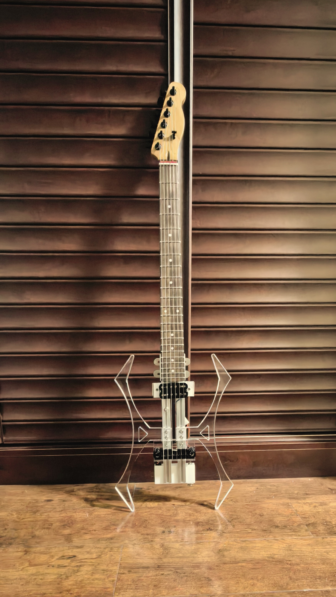

# MOGI: A Minimalist Modular Guitar Platform

## Concept and Philosophy

MOGI is a minimalist, DIY-friendly electric guitar platform. The core philosophy is to build a highly functional, "bodyless" instrument using readily available, off-the-shelf materials. 

The system is fully modular, built around a core "body" of two parallel T-slot aluminum extrusions. Thanks to the continuous slots on these extrusions, builders can easily mount, slide, and swap any module along the length of the guitar. By using simple, custom-designed connectors, almost any standard guitar component—pickups, electronics, bridges, or built-in preamps—can be adapted into a MOGI module. This provides players and makers with extreme flexibility to explore endless hardware combinations.

**Project Motivations:**
1. **Tone Isolation:** To eliminate the acoustic and resonant influence of a traditional solid guitar body.
2. **Ultimate Flexibility:** To provide a robust platform where hardware permutations can be tested and swapped with ease.

---

## MOGI MK4: The Current Standard

MOGI MK4 is the latest proof-of-concept build. It represents a complete, fully functional minimalist guitar and serves as the reference model for this repository. 

### Core Design Architecture

At the heart of the MOGI system are two parallel **2020 aluminum extrusions**. 

All functional modules are standard guitar parts (though custom ones can be crafted) that attach to this extrusion core using custom **connectors**. The step files for all connectors are provided in this repository. 

*Note on Manufacturing:* In principle, all connectors can be 3D-printed. However, components subjected to high string tension (such as bridge anchors or tailpieces) require significant structural integrity. For these load-bearing parts, CNC-machined acrylic or aluminum is highly recommended over standard 3D-printed plastics.

### Module Breakdown (MK4 Configuration)

Below are the specific design choices for the MOGI MK4 build:

* **Neck Module:** MK4 uses a standard Telecaster-style neck with a flat heel and a standard 56mm width. The custom neck connector acts as a locator block between the neck and the two extrusions, utilizing a standard 4-bolt connection.
    

* **Pickup Module:** Catering to a streamlined, high-gain preference, MK4 features a single active pickup positioned at the 24th fret harmonic node. Because the pickup connector does not bear any physical load, it is perfectly safe to 3D-print. The connector is designed to mount any standard pickup using a two-screw slot with an 83mm spacing. For pickups with irregular mounting dimensions, you can easily accommodate them by installing a simple adapter plate.

* **Bridge Module:** For simplicity and tuning stability, MK4 utilizes a wraparound-style bridge (combining the bridge and tailpiece into one unit). Because the T-slot extrusions are continuous, the bridge connector can slide freely, allowing the effective scale length and intonation to be set perfectly for *any* standard neck scale. *(Note: Previous iterations, like MK3, utilized a classic tune-o-matic bridge and separate tailpiece, which are also compatible).*
    

* **Tail / Electronics Module:** The tail block doubles as an enclosure for the guitar's electronics. It features a long-barrel TRS jack for robust cable connection. For power, it uses an A23 battery box. The A23 12V battery is ideal here: it is significantly smaller than a standard 9V battery, saving space, while providing higher voltage headroom for the active pickup.

* **Wing Modules:** While not electronically functional, MK4 includes two "wings" to provide ergonomic support against the player's body. The wings are axis-symmetric and center-symmetric, making them incredibly easy to manufacture and mount.

---

## Bill of Materials (BOM)

To build the MOGI MK4 as designed, you will need the following components:

### Structural Core & Custom Parts
| Name | Qty | Notes |
| :--- | :--- | :--- |
| 2020 Aluminum Extrusion | 2 | 300 mm length |
| Neck Connector | 1 | Custom part (Repository) |
| Pickup Connector | 1 | Custom part (Repository) |
| Bridge Connector | 1 | Custom part (Repository) - *Acrylic/Metal recommended* |
| Tail Enclosure | 1 | Custom part (Repository) |
| Body Wings | 2 | Custom part (Repository) |

### Guitar Hardware
| Name | Qty | Notes |
| :--- | :--- | :--- |
| Guitar Neck | 1 | Telecaster-style flat heel (56mm width) works best |
| Wraparound Bridge | 1 | Combined bridge/tailpiece |
| Tuning Machines | 6 | Standard string winders to match your neck |
| Guitar Strings | 1 | Standard 6-string set |
| Strap Buttons | 2 | Standard |

### Electronics
| Name | Qty | Notes |
| :--- | :--- | :--- |
| Active Pickup | 1 | Maker's choice |
| TRS Jack | 1 | Long barrel-shape recommended |
| A23 Battery Box | 1 | Should match the pre-cut space in the Tail part |
| Hookup Wire | 1 | For connecting the TRS jack to the pickup |

### Fasteners & Hardware
| Name | Qty | Notes |
| :--- | :--- | :--- |
| M4 T-nuts | 14 | For T-slot mounting |
| M4 Screws (5mm) | 14 | |
| M4 Screws (15mm)| 2 | |
| M4 Screws (25mm)| 2 | |
| M3 Screws (30mm)| 2 | For pickup mounting|
| M3 Nuts | 2 | For pickup mounting|